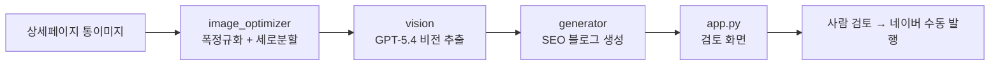

# Eduino_PostPilot 연구개발 기록

> 연구노트 작성용 개발 문서. 기획 → 설계 → 구현 → 검증의 흐름과 의사결정 근거, 시행착오를 단계별로 정리했습니다.
> 각 단계 끝의 "📒 연구노트 기록 포인트"는 노트에 옮겨 적을 핵심 요약입니다.

---

## 0. 과제 개요

| 항목 | 내용 |
|---|---|
| 과제명 | 상세페이지 통이미지 기반 블로그 콘텐츠 자동 생성 시스템 |
| 목적 | 제품 상세페이지(통이미지) 자산을 블로그 콘텐츠로 재활용해 검색 노출·쇼핑몰 유입 확대 |
| 대상 | 에듀이노 아두이노 교육용 제품 |
| 결과물 | 통이미지 입력 → SEO 블로그 초안 자동 생성 데스크톱 프로그램 |
| 핵심 제약 | 네이버 자동발행 금지(어뷰징 리스크) → 생성 자동 + 발행 수동의 반자동 구조 |

📒 **연구노트 기록 포인트**
- 무엇을, 왜 만들었는가: 수작업 블로그 작성을 통이미지 입력만으로 초안화하여 콘텐츠 생산성·검색 노출 향상.

---

## 1. 기획 단계 — 문제 정의와 방향 결정

### 1-1. 해결할 문제
- 제품마다 상세페이지(통이미지)에 실습코드·가이드가 있으나, 블로그 콘텐츠로 재가공하는 작업이 전부 수작업.
- 검색 상위 노출(SEO)과 쇼핑몰 유입을 동시에 달성할 콘텐츠가 필요.

### 1-2. 자동화 수준 결정 (핵심 의사결정)
세 가지 방식을 비교해 **반자동(B안)**을 채택.

| 방식 | 내용 | 제재 위험 | 채택 |
|---|---|---|---|
| A 생성도구형 | 초안 생성까지만 | 없음 | |
| B 반자동 | 생성 자동 + 사람 검토 후 수동 발행 | 낮음 | ✅ |
| C 완전자동 | 발행까지 무인 | 높음(저품질) | |

근거: 네이버는 자동·대량 발행을 어뷰징으로 탐지해 저품질 처리하므로, 상업적 유입이 목적일수록 완전자동(C)은 목적과 충돌. 생성만 자동화하고 발행은 사람이 검토.

📒 **연구노트 기록 포인트**
- 자동화 수준을 "반자동"으로 결정. 이유: 네이버 어뷰징 정책상 완전 자동발행은 저품질·제재 위험.

---

## 2. 기술 선정 — 왜 이 도구인가

### 2-1. 언어/실행 환경
| 후보 | 결정 | 근거 |
|---|---|---|
| Python | ✅ | 비전 API·이미지 처리 생태계, 빠른 개발 |
| 실행: Streamlit | ✅ | 코드 최소로 GUI 구현, 브라우저 화면 제공, 개인 PC에서 즉시 실행 |
| 실행: CLI | | 담당자·시연에 부적합 |

### 2-2. LLM(비전) 선정
| 후보 | 결정 | 근거 |
|---|---|---|
| OpenAI GPT-5.4 | ✅ | 비용/품질 균형. 한글+아두이노 코드 혼합 이미지 인식 우수 |
| GPT-5.5 | | 품질 최상이나 추론 토큰으로 비용↑, 본 작업엔 과함 |
| 구형 GPT-4o | | 비라틴 문자·작은 글씨 인식 약점 |

추가 설정: 추출은 과한 추론 불필요 → reasoning_effort=low, 작은 코드 글씨 인식 위해 image detail=high.

### 2-3. 배포 방식 검토
| 후보 | 결정 | 근거 |
|---|---|---|
| run.bat 더블클릭 | ✅ | 명령어 없이 실행, 개인 PC 전용에 최적 |
| Docker | | 다기기 환경 일관성엔 유리하나, 명령어 기반이라 "바로 실행" 목적과 불일치 |
| exe 패키징 | | Streamlit은 패키징이 무겁고 불안정 |

📒 **연구노트 기록 포인트**
- 핵심 스택: Python + Streamlit + OpenAI GPT-5.4.
- LLM은 비용/품질 균형으로 5.4 채택, 추론 강도·이미지 디테일을 작업에 맞게 조정.
- 배포는 개인 PC 더블클릭(run.bat) 방식 선택(Docker 대비 즉시성 우선).

---

## 3. 시스템 설계 — 아키텍처

### 3-1. 처리 파이프라인

### 3-2. 핵심 설계 결정
| 단계 | 문제 | 설계 해법 |
|---|---|---|
| 이미지 입력 | 통이미지가 세로로 매우 김(예 664×5864, 8.8배) | 통째로 넣으면 작은 글씨·코드 뭉개짐 → 폭 정규화 + 세로 분할(겹침) |
| 추출 | 한글·코드 정확도 | 분할 조각을 한 번에 비전 전달, "코드는 보이는 그대로만" 프롬프트 규칙 |
| 생성 | AI 양산형 티 | 마크다운 강조 기호 금지, 사람 문체 규칙, 제목 후보 다수 |
| 이미지 배치 | 결선도·결과사진 삽입 | 글에는 [이미지 N] 자리표시만, 발행 시 사람이 삽입 |

### 3-3. 모듈 구성
| 모듈 | 역할 |
|---|---|
| config.py | 모델·경로·이미지 파라미터·쇼핑몰/링크 설정 |
| image_loader.py | 제품 폴더 스캔 + 폴더명 파싱([순번] 코드_제품명) |
| image_optimizer.py | 통이미지 폭 정규화 + 세로 분할 |
| vision.py | 조각 → GPT-5.4 → 구조화 추출 |
| generator.py | 추출 결과 → SEO 블로그 생성 |
| state.py | 발행 상태 관리(미작업/초안/발행) |
| app.py | Streamlit 화면 |

📒 **연구노트 기록 포인트**
- 파이프라인: 통이미지 → 분할 → 비전추출 → 생성 → 검토.
- 긴 통이미지는 분할로 인식률 확보가 핵심 기술 포인트.
- 모듈을 역할별로 분리(설정/로더/분할/추출/생성/상태/화면).

---

## 4. 구현 & 시행착오 기록

실제 개발 중 마주친 문제와 해결을 기록 (재현·재발방지용).

| # | 문제 | 원인 | 해결 |
|---|---|---|---|
| 1 | .gitignore가 적용 안 됨 | 다운로드 시 파일명 점(.) 누락(`gitignore`) | 파일명 점 복원(`.gitignore`) |
| 2 | PRODUCTS_ROOT 경로 깨짐 | .env에 `PRODUCTS_ROOT=` 값 중복 입력 | config 기본값을 코드에 고정, 빈값 자동 처리 |
| 3 | API 401 인증 실패 | 키 앞에 `sk-` 중복(`sk-sk-...`) | 템플릿 sk- 뒤에 키를 또 붙인 실수 → 키 전체 한 번만 입력 |
| 4 | 본문에 별표(**) 노출 | 마크다운 강조를 네이버가 미해석 | 프롬프트에 강조 기호 금지 규칙 추가 |
| 5 | git commit 실패 | git 사용자(user.name/email) 미설정 | git config로 사용자 등록 |
| 6 | git push 실패 | GitHub 원격 레포 미생성 | 레포 생성 후 push |
| 7 | config import 실패 | venv 미활성 상태로 실행 | venv 활성화(run.bat이 자동화) |
| 8 | 디자인 양산형 | 기본 Streamlit 스타일 | 브랜드 헤더·카드·틸 악센트·Pretendard 적용 |

📒 **연구노트 기록 포인트**
- 주요 시행착오: 경로/키 입력 오류, 네이버 마크다운 비호환, git 초기설정.
- 재발방지: 경로·실행을 코드/스크립트로 자동화하여 수동 입력 의존 제거.

---

## 5. 검증

| 검증 항목 | 방법 | 결과 |
|---|---|---|
| 통이미지 분할 | 실제 이미지 분할 미리보기(과금 0) | 5조각, 코드 글씨 가독 확인 |
| 비전 추출 | 실제 추출 후 소스코드 대조 | 표준 Blink 코드와 일치 |
| 블로그 생성 | 생성문 검토 | 강조기호 제거·자연 문체·SEO 키워드 정상 |
| 경로 자동계산 | core/ 이동 후 검증 | Product_eduino/output 정확히 인식 |
| 실행 | run.bat 더블클릭 | 브라우저 자동 실행 |

📒 **연구노트 기록 포인트**
- 비용 발생 전 무료 단계(분할 미리보기)로 먼저 검증하는 절차 확립.
- 소스코드 정확도를 사람이 대조 검증(블로그 신뢰도 직결).

---

## 6. 성과 및 향후 연구 방향

### 성과
- 통이미지 입력만으로 SEO 블로그 초안 자동 생성 → 콘텐츠 생산 시간 단축.
- 개인 PC 더블클릭 실행으로 진입장벽 최소화.

### 향후 연구 방향
| 후보 | 기대 효과 |
|---|---|
| 섹션 자동 크롭 | 이미지 자리별 사진 자동 분리로 발행 편의↑ |
| 네이버 검색광고 API 연동 | 실제 검색량 기반 키워드로 SEO 정밀화 |
| 다기기 환경 일관성(Docker) | 여러 작업 환경 동기화 |
| 발행 효과 분석 | 노출·유입 데이터 피드백 루프 구축 |

📒 **연구노트 기록 포인트**
- 정량 효과(작성 시간 단축)와 다음 연구 과제(키워드 정밀화·효과 분석) 명시.

---

## 부록. 개발 타임라인 요약
기획(자동화 수준 결정) → 기술선정(스택·LLM) → 환경구축 → 이미지 분할 → 비전 추출 → 블로그 생성 → UI → 구조 정리(core) → 디자인 → 프로그램화(run.bat) → 문서화.
