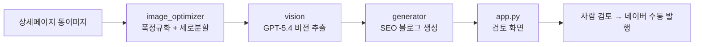

# Eduino_PostPilot 연구개발 기록

> 연구노트 작성용 개발 문서. 기획 → 설계 → 구현 → 검증의 흐름과 의사결정 근거, 시행착오를 단계별로 정리했습니다.
> 각 단계 끝의 "📒 연구노트 기록 포인트"는 노트에 옮겨 적을 핵심 요약입니다.

---

## 요약 (Abstract)

본 연구는 제품 상세페이지의 **통이미지(세로로 매우 긴 단일 이미지)** 자산을, 추가
촬영·기획 없이 **검색 최적화(SEO) 블로그 초안**으로 자동 변환하는 데스크톱 시스템을
설계·구현한 기록이다. 핵심 난점은 (1) 통이미지가 폭 대비 세로가 8배 이상 길어 비전
모델에 통째로 넣으면 작은 코드 글씨가 뭉개지는 문제, (2) 네이버의 자동·대량 발행
어뷰징 정책상 발행까지 자동화하면 저품질 제재 위험이 있다는 제약이다.

이를 (1) **폭 정규화(1280px) + 겹침 분할(1500px, 100px overlap)** 전처리 후 멀티이미지
비전 추출, (2) **'생성은 자동, 발행은 사람'의 반자동 구조**로 해결했다. 추출→생성
2단계 LLM 파이프라인(OpenAI GPT-5.4, 추출/생성 프롬프트 분리)에 상태관리(SQLite)와
자사 쇼핑몰(Cafe24) 자동 수집(크롤링)을 결합해, **이미지 입력만으로 블로그 초안이
산출되는** 엔드투엔드 워크플로를 완성했다. 배포는 비전문 실무자도 쓸 수 있도록
**앱 내 1회 키 입력 + 무설치 실행파일(.exe)** 로 진입장벽을 제거했다.

| 구분 | 값 |
|---|---|
| 입력 | 상세페이지 통이미지(또는 자사몰 자동 수집분) |
| 처리 | 폭 정규화 → 겹침 세로분할 → 비전 추출 → SEO 블로그 생성 |
| 출력 | 마크다운 블로그 초안(제목 후보·메타·본문·이미지 자리표시·관련 링크) |
| 모델 | OpenAI GPT-5.4 (reasoning_effort=low, image detail=high) |
| 자동화 범위 | 수집 + 초안 생성까지 (발행은 사람 검토 후 수동) |
| 구현 규모 | Python 약 2,370 LOC(핵심 7모듈) + 프롬프트 2종 |

---

## 0. 과제 개요

| 항목 | 내용 |
|---|---|
| 과제명 | 상세페이지 통이미지 기반 블로그 콘텐츠 자동 생성 시스템 |
| 목적 | 제품 상세페이지(통이미지) 자산을 블로그 콘텐츠로 재활용해 검색 노출·쇼핑몰 유입 확대 |
| 대상 | 에듀이노 아두이노 교육용 제품 |
| 결과물 | 통이미지 입력 → SEO 블로그 초안 자동 생성 데스크톱 프로그램 |
| 핵심 제약 | 네이버 자동발행 금지(어뷰징 리스크) → 생성 자동 + 발행 수동의 반자동 구조 |

📒 **연구노트 기록 포인트**
- 무엇을, 왜 만들었는가: 수작업 블로그 작성을 통이미지 입력만으로 초안화하여 콘텐츠 생산성·검색 노출 향상.

---

## 1. 기획 단계 — 문제 정의와 방향 결정

### 1-1. 해결할 문제
- 제품마다 상세페이지(통이미지)에 실습코드·가이드가 있으나, 블로그 콘텐츠로 재가공하는 작업이 전부 수작업.
- 검색 상위 노출(SEO)과 쇼핑몰 유입을 동시에 달성할 콘텐츠가 필요.

### 1-2. 자동화 수준 결정 (핵심 의사결정)
세 가지 방식을 비교해 **반자동(B안)**을 채택.

| 방식 | 내용 | 제재 위험 | 채택 |
|---|---|---|---|
| A 생성도구형 | 초안 생성까지만 | 없음 | |
| B 반자동 | 생성 자동 + 사람 검토 후 수동 발행 | 낮음 | ✅ |
| C 완전자동 | 발행까지 무인 | 높음(저품질) | |

근거: 네이버는 자동·대량 발행을 어뷰징으로 탐지해 저품질 처리하므로, 상업적 유입이 목적일수록 완전자동(C)은 목적과 충돌. 생성만 자동화하고 발행은 사람이 검토.

📒 **연구노트 기록 포인트**
- 자동화 수준을 "반자동"으로 결정. 이유: 네이버 어뷰징 정책상 완전 자동발행은 저품질·제재 위험.

---

## 2. 기술 선정 — 왜 이 도구인가

### 2-1. 언어/실행 환경
| 후보 | 결정 | 근거 |
|---|---|---|
| Python | ✅ | 비전 API·이미지 처리 생태계, 빠른 개발 |
| 실행: Streamlit | ✅ | 코드 최소로 GUI 구현, 브라우저 화면 제공, 개인 PC에서 즉시 실행 |
| 실행: CLI | | 담당자·시연에 부적합 |

### 2-2. LLM(비전) 선정
| 후보 | 결정 | 근거 |
|---|---|---|
| OpenAI GPT-5.4 | ✅ | 비용/품질 균형. 한글+아두이노 코드 혼합 이미지 인식 우수 |
| GPT-5.5 | | 품질 최상이나 추론 토큰으로 비용↑, 본 작업엔 과함 |
| 구형 GPT-4o | | 비라틴 문자·작은 글씨 인식 약점 |

추가 설정: 추출은 과한 추론 불필요 → reasoning_effort=low, 작은 코드 글씨 인식 위해 image detail=high.

### 2-3. 배포 방식 검토
| 후보 | 결정 | 근거 |
|---|---|---|
| run.bat 더블클릭 | ✅ | 명령어 없이 실행, 개인 PC 전용에 최적 |
| Docker | | 다기기 환경 일관성엔 유리하나, 명령어 기반이라 "바로 실행" 목적과 불일치 |
| exe 패키징 | | Streamlit은 패키징이 무겁고 불안정 |

📒 **연구노트 기록 포인트**
- 핵심 스택: Python + Streamlit + OpenAI GPT-5.4.
- LLM은 비용/품질 균형으로 5.4 채택, 추론 강도·이미지 디테일을 작업에 맞게 조정.
- 배포는 개인 PC 더블클릭(run.bat) 방식 선택(Docker 대비 즉시성 우선).

---

## 3. 시스템 설계 — 아키텍처

### 3-1. 처리 파이프라인


### 3-2. 핵심 설계 결정
| 단계 | 문제 | 설계 해법 |
|---|---|---|
| 이미지 입력 | 통이미지가 세로로 매우 김(예 664×5864, 8.8배) | 통째로 넣으면 작은 글씨·코드 뭉개짐 → 폭 정규화 + 세로 분할(겹침) |
| 추출 | 한글·코드 정확도 | 분할 조각을 한 번에 비전 전달, "코드는 보이는 그대로만" 프롬프트 규칙 |
| 생성 | AI 양산형 티 | 마크다운 강조 기호 금지, 사람 문체 규칙, 제목 후보 다수 |
| 이미지 배치 | 결선도·결과사진 삽입 | 글에는 [이미지 N] 자리표시만, 발행 시 사람이 삽입 |

### 3-3. 모듈 구성
| 모듈 | 역할 |
|---|---|
| config.py | 모델·경로·이미지 파라미터·쇼핑몰/링크 설정 |
| image_loader.py | 제품 폴더 스캔 + 폴더명 파싱([순번] 코드_제품명) |
| image_optimizer.py | 통이미지 폭 정규화 + 세로 분할 |
| vision.py | 조각 → GPT-5.4 → 구조화 추출 |
| generator.py | 추출 결과 → SEO 블로그 생성 |
| state.py | 발행 상태 관리(미작업/초안/발행) |
| app.py | Streamlit 화면 |

### 3-4. 핵심 파라미터와 설계 근거

실제 동작을 결정하는 주요 상수와 그 근거(모두 `config.py`에서 일괄 관리, .env로 조정 가능).

| 파라미터 | 값 | 근거 |
|---|---|---|
| `IMAGE_TARGET_WIDTH` | 1280px | 폭을 표준화해 토큰/비용을 일정하게. 1280px면 코드 글씨 가독 유지. 작으면 업스케일하지 않음(인위적 화질저하 방지) |
| `IMAGE_SLICE_HEIGHT` | 1500px | 한 조각이 너무 길면 글씨 뭉개짐, 너무 짧으면 조각수↑(비용↑). 가독·비용 절충점 |
| `IMAGE_SLICE_OVERLAP` | 100px | 자르는 경계에서 코드 한 줄·문장이 끊기는 것을 방지(인접 조각이 100px 겹침). 실효 보폭 step = 1500−100 = **1400px** |
| 리샘플링 | LANCZOS | 축소 시 글자 경계 보존에 유리한 고품질 필터 |
| `OPENAI_MODEL` | gpt-5.4 | 한글+아두이노 코드 혼합 이미지 인식 품질과 비용의 균형점 |
| `OPENAI_IMAGE_DETAIL` | high | 작은 코드 글씨·핀 번호 인식 위해 고해상 분석 강제 |
| `OPENAI_REASONING_EFFORT` | low | 추출·정형화는 과한 추론 불필요 → 지연·비용 절감 |
| `MAX_OUTPUT_TOKENS`(추출) | 4000 | 구조화 추출 결과 분량 상한 |
| `GEN_MAX_TOKENS`(생성) | 6000 | 블로그 본문 분량 상한(제목 후보·본문·링크 포함) |
| `GEN_WORKERS` | 3 | 일괄 생성 시 API 대기를 병렬화해 벽시계 시간 단축(레이트리밋·순간비용 고려한 보수값) |
| `OWN_CODE_PREFIXES` | A~E | 제품코드 첫 글자로 자사/입점사 판별 → 블로그 작성 대상 자동 필터 |

> 통이미지 인식의 핵심은 **"폭은 줄여 비용을 고정하되, 세로는 겹쳐 잘라 정보 손실을 막는다"**는
> 두 축의 균형이다. 예: 664×5864 통이미지는 폭 1280 이하라 원본 유지, 보폭 1400px로
> 분할되어 약 **5조각**이 되고, 5장을 순서대로 한 번의 비전 호출에 전달한다.

📒 **연구노트 기록 포인트**
- 파이프라인: 통이미지 → 분할 → 비전추출 → 생성 → 검토.
- 긴 통이미지는 분할로 인식률 확보가 핵심 기술 포인트.
- 모듈을 역할별로 분리(설정/로더/분할/추출/생성/상태/화면).
- 핵심 파라미터(폭 1280·조각 1500·겹침 100·detail high·effort low)는 모두 가독성과 비용의 절충 결과.

---

## 4. 구현 & 시행착오 기록

실제 개발 중 마주친 문제와 해결을 기록 (재현·재발방지용).

| # | 문제 | 원인 | 해결 |
|---|---|---|---|
| 1 | .gitignore가 적용 안 됨 | 다운로드 시 파일명 점(.) 누락(`gitignore`) | 파일명 점 복원(`.gitignore`) |
| 2 | PRODUCTS_ROOT 경로 깨짐 | .env에 `PRODUCTS_ROOT=` 값 중복 입력 | config 기본값을 코드에 고정, 빈값 자동 처리 |
| 3 | API 401 인증 실패 | 키 앞에 `sk-` 중복(`sk-sk-...`) | 템플릿 sk- 뒤에 키를 또 붙인 실수 → 키 전체 한 번만 입력 |
| 4 | 본문에 별표(**) 노출 | 마크다운 강조를 네이버가 미해석 | 프롬프트에 강조 기호 금지 규칙 추가 |
| 5 | git commit 실패 | git 사용자(user.name/email) 미설정 | git config로 사용자 등록 |
| 6 | git push 실패 | GitHub 원격 레포 미생성 | 레포 생성 후 push |
| 7 | config import 실패 | venv 미활성 상태로 실행 | venv 활성화(run.bat이 자동화) |
| 8 | 디자인 양산형 | 기본 Streamlit 스타일 | 브랜드 헤더·카드·틸 악센트·Pretendard 적용 |

📒 **연구노트 기록 포인트**
- 주요 시행착오: 경로/키 입력 오류, 네이버 마크다운 비호환, git 초기설정.
- 재발방지: 경로·실행을 코드/스크립트로 자동화하여 수동 입력 의존 제거.

---

## 5. 검증

| 검증 항목 | 방법 | 결과 |
|---|---|---|
| 통이미지 분할 | 실제 이미지 분할 미리보기(과금 0) | 5조각, 코드 글씨 가독 확인 |
| 비전 추출 | 실제 추출 후 소스코드 대조 | 표준 Blink 코드와 일치 |
| 블로그 생성 | 생성문 검토 | 강조기호 제거·자연 문체·SEO 키워드 정상 |
| 경로 자동계산 | core/ 이동 후 검증 | Product_eduino/output 정확히 인식 |
| 실행 | run.bat 더블클릭 | 브라우저 자동 실행 |

📒 **연구노트 기록 포인트**
- 비용 발생 전 무료 단계(분할 미리보기)로 먼저 검증하는 절차 확립.
- 소스코드 정확도를 사람이 대조 검증(블로그 신뢰도 직결).

---

## 6. 성과 및 향후 연구 방향

### 성과
- 통이미지 입력만으로 SEO 블로그 초안 자동 생성 → 콘텐츠 생산 시간 단축.
- 개인 PC 더블클릭 실행으로 진입장벽 최소화.

### 향후 연구 방향
| 후보 | 기대 효과 |
|---|---|
| 섹션 자동 크롭 | 이미지 자리별 사진 자동 분리로 발행 편의↑ |
| 네이버 검색광고 API 연동 | 실제 검색량 기반 키워드로 SEO 정밀화 |
| 다기기 환경 일관성(Docker) | 여러 작업 환경 동기화 |
| 발행 효과 분석 | 노출·유입 데이터 피드백 루프 구축 |

📒 **연구노트 기록 포인트**
- 정량 효과(작성 시간 단축)와 다음 연구 과제(키워드 정밀화·효과 분석) 명시.

---

## 7. 기능 확장 — 쇼핑몰 자동 수집(크롤링)

수동으로 제품 폴더를 만들어 통이미지를 넣던 입력 단계를, 자사 쇼핑몰에서 자동
수집하도록 확장했습니다. (리소스가 쌓이거나 수동 업데이트 시간이 없을 때 대비)

### 7-1. 타당성 검토 (핵심 의사결정)
| 확인 항목 | 결과 |
|---|---|
| 쇼핑몰 플랫폼 | **Cafe24** (`eduino.cafe24.com`, `www.eduino.kr`) → 표준 URL로 목록/상세 접근 가능 |
| 기존 구조와의 정합성 | 입력부가 `Product_eduino` 폴더 스캔으로 격리돼 있어, 크롤러가 폴더만 채우면 이후 단계 전부 재사용 |
| 다중 상세이미지 | Cafe24 상세는 여러 장으로 쪼개진 경우가 많음 → `vision.extract_from_paths`로 여러 장 이어붙여 처리 |
| 상품 링크 범위 | 자사몰만 대상(요구사항) |

결론: 현 시스템에서 충돌 없이 가능. 크롤러는 "사람이 폴더를 채우던 일"만 대체.

### 7-2. 수집 방식 결정
| 방식 | 결정 | 근거 |
|---|---|---|
| 스토어프론트 HTML 스크래핑 | ✅ (1차) | 토큰 세팅 없이 즉시 동작. 자사몰이라 정책 부담 없음 |
| Cafe24 OpenAPI | ▶ (종착지) | 봇 차단·구조 변경에 강함. 추후 `ProductSource` 인터페이스로 교체 |

확장성 설계: 수집원을 `ProductSource` 추상 인터페이스로 분리하고 `Cafe24StorefrontSource`
구현체를 둠. 저장/오케스트레이션 코드는 그대로 두고 소스만 교체하면 API로 전환 가능.

### 7-3. 시행착오 / 설계 보강
| 문제 | 해결 |
|---|---|
| 봇 차단(403) | 브라우저 User-Agent + 요청 간 `CRAWL_DELAY_SEC` 대기로 부하·차단 완화 |
| 상세설명 외 이미지(로고/배너) 혼입 | `#prdDetail` 범위 안의 ``만 수집, 못 찾으면 스킨 경로 제외 폴백 |
| 지연로딩 이미지 | `ec-data-src`/`data-src` 우선 추출 |
| HTML 파서 추가 의존성 | bs4 대신 표준 `html.parser`로 구현(의존성 최소, 오프라인 단위테스트 가능) |
| 비용 폭주 | 카테고리+건수 선택, "미작업(none)만 일괄 생성", 예상 과금 표시 |
| 다음 할 일 가시성 | [작업 현황] 탭에서 미작업/초안/발행 집계 + 필터 표 제공 |

### 7-4. 검증
- 파서: 목록/상세 HTML 픽스처로 오프라인 단위테스트(`python crawler.py --selftest`).
- 글루: 가짜 수집원으로 수집→폴더생성→로더→상태→워크리스트 통합 검증(과금 0).
- ⚠ 실제 쇼핑몰 수집·OpenAI 생성은 네트워크가 열린 사용자 PC에서 최종 확인 필요.

📒 **연구노트 기록 포인트**
- 쇼핑몰이 Cafe24라 표준 URL 수집이 가능, 기존 폴더 입력 규칙을 그대로 재사용해 확장.
- 수집원을 인터페이스로 분리(스크래핑 → 추후 OpenAPI 교체)하여 안정성 확장 경로 확보.
- 발행은 여전히 수동 — 자동화 범위는 '수집 + 초안 생성'까지로 제한(어뷰징 정책 유지).

---

## 8. UI/UX 전면 개편 — 다크 테마 · 작업 동선 재설계

실무 사용 피드백을 반영해 화면을 "보기 좋게"가 아니라 "작업하기 편하게" 기준으로 재설계.

### 8-1. 검토 패널 가독성·복사 동선
| 문제 | 해결 |
|---|---|
| 생성 결과가 한 덩어리로 보여 어디가 제목/메타/본문인지 구분 어려움 | 색 점 라벨 소카드로 영역 분리, 본문은 넓은 2단 레이아웃 |
| 네이버 붙여넣기용 복사가 번거로움 | 본문 우측 상단 [복사] 버튼(클립보드), 이미지 자리·소제목 자동 정리 |
| 복사 버튼이 제목 아래로 떨어져 어수선 | 제목과 버튼을 한 줄에 정렬 |
| 코드박스 한글이 monospace로 띄엄띄엄·잘림 | 비례폰트 + 줄바꿈 정상화로 왼쪽 정렬 |

### 8-2. 다크 테마 + 브랜드 (레퍼런스 기반 재디자인)
| 결정 | 내용 |
|---|---|
| 톤 | 밝은 톤 → **다크(#0a0e16)**. 사내 AI LAB 화면을 레퍼런스로 통일감 확보 |
| 브랜드 컬러 | 에듀이노 **레드(#f0584d)** 로 primary·헤더·강조 통일 |
| 폰트 | 라운드형 **Jua**(디스플레이) + Pretendard(본문). Jua는 400 단일 굵기라 800 지정 시 합성볼드로 뭉개짐 → 400 고정 |
| 동선 넘버링 | 상단 번호 스테퍼(① 수집 → ② 생성 → ③ 검토 → ④ 발행), 현재 단계 강조 + 카운트 |
| 영역 구분 | 섹션별 컬러 헤더 띠/좌측 보더(생성=청록, 검토=보라), 가변 생성 데이터는 반투명 레드 하이라이트로 '적용값' 반전 표시 |

📒 **연구노트 기록 포인트**
- "예쁘게"가 아니라 "작업 순서가 화면에 그대로 보이게" 재설계(넘버링 스테퍼·영역 색 구분).
- 라운드 웹폰트 적용 시 단일 굵기 폰트의 합성볼드 뭉개짐 → 굵기 고정으로 해결.

---

## 9. 배포 고도화 — 무설치 실행파일(.exe) + 키 온보딩

여러 실무자 공유 요구가 생기면서 "세팅 없이 더블클릭"을 목표로 배포 방식을 재검토.
(2-3절에서 한 차례 보류했던 exe 패키징을, 요구사항 변화에 따라 재도전·구현)

### 9-1. OpenAI 키 입력 방식 (핵심 의사결정)
| 방식 | 결정 | 근거 |
|---|---|---|
| 계정 로그인(OAuth) | ✕ | OpenAI는 API용 계정 로그인 방식을 제공하지 않음(ChatGPT 로그인 ≠ API) |
| .env 파일 직접 편집 | △ | 비전문가에겐 부담 |
| **앱 내 키 입력 → 로컬 저장 → 자동** | ✅ | 최초 1회 입력, 이 PC(`~/.eduino_postpilot/config.json`, 권한 600)에만 저장. 파일 안 건드림 |

구현: 키 없으면 온보딩 화면만 표시 후 정지. 연결 테스트(models.list, 무과금) 후 저장 또는
건너뛰고 저장. 클라이언트가 호출 시점에 키를 읽어 **재시작 없이 즉시 반영**. 상단 설정에서 변경/삭제.

### 9-2. 실행파일 패키징 (PyInstaller)
| 항목 | 결정/해법 |
|---|---|
| 형태 | onedir(`dist/EduinoPostPilot/`) — onefile보다 기동 빠르고 안정적. 폴더째 zip 배포 |
| 진입점 | `launcher.py` — core/ 를 sys.path 추가, 테마를 **환경변수로 고정**(config.toml 경로 의존 제거) |
| 경로 | frozen 감지 — data/output/제품은 **exe 옆**(쓰기), prompts는 **번들**(읽기)로 분리 |
| 빌드 | `build_exe.bat` 더블클릭 1회(venv·의존성·PyInstaller 자동) → 끝나면 **바탕화면 바로가기 자동 생성** + 아이콘 |

### 9-3. 시행착오
| 문제 | 원인 | 해결 |
|---|---|---|
| 패키지 실행 시 콘솔이 입력 대기로 멈춤 | Streamlit 최초 실행의 이메일 수집 프롬프트 | launcher가 `~/.streamlit/credentials.toml`을 선생성해 억제 |
| 테마가 exe에서 안 먹힘 | config.toml 을 CWD 기준으로 탐색 | 테마를 `STREAMLIT_THEME_*` 환경변수로 고정 |
| 출력/DB가 임시폴더에 쓰여 사라짐 | frozen 시 기준 경로가 번들 임시폴더 | 쓰기 경로를 exe 위치 기준으로 분리 |
| 라운드폰트 CDN 미로드 | Cafe24 폰트 경로 404 | 검증 가능한 fontsource의 **Jua**로 교체 |

📒 **연구노트 기록 포인트**
- API 키는 '계정 로그인'이 불가하므로, 앱 내 1회 입력 후 로컬 저장하는 온보딩으로 진입장벽 제거.
- Streamlit 앱의 exe화 난점(최초 프롬프트·테마 경로·쓰기 경로)을 각각 우회해 무설치 배포 달성.
- 보류했던 결정(exe)도 요구사항 변화 시 재검토하는 것이 타당.

---

## 부록 A. 개발 타임라인 요약
기획(자동화 수준 결정) → 기술선정(스택·LLM) → 환경구축 → 이미지 분할 → 비전 추출 → 블로그 생성 → UI → 구조 정리(core) → 디자인 → 프로그램화(run.bat) → 문서화 → 쇼핑몰 자동 수집(크롤링) 확장 → **검토 동선·가독성 개선 → 다크 테마/라운드폰트/넘버링 재디자인 → 앱 내 키 온보딩 → 무설치 실행파일(.exe)·바탕화면 배포**.

---

## 부록 B. 처리 파이프라인 입출력 명세

각 단계의 입력·처리·출력·관여 파라미터를 정리한다(재현 및 인수인계용).

| 단계 | 모듈 | 입력 | 처리 | 출력 |
|---|---|---|---|---|
| 0. 수집(선택) | `crawler.py` | 카테고리 번호, 건수 | Cafe24 목록/상세 HTML 파싱 → 상세이미지 다운로드 | `PRODUCTS_ROOT/[순번] 코드_제품명/detail_NN.jpg` |
| 1. 로드 | `image_loader.py` | 제품 폴더 | 폴더명 `[순번] 코드_제품명` 파싱, 이미지 목록화 | 제품 메타(순번·코드·이름·이미지경로) |
| 2. 전처리 | `image_optimizer.py` | 통이미지 1장+ | 폭 정규화(≤1280) → 겹침 세로분할(1500/100) | 조각 이미지 리스트 |
| 3. 추출 | `vision.py` | 조각 리스트 | 순서대로 1회 비전 호출(detail=high) | 구조화 마크다운(추출 정보) |
| 4. 생성 | `generator.py` | 추출 마크다운 + 제품 메타 | SEO 블로그 작성(추출 정보만 사용) | 블로그 초안 마크다운 |
| 5. 검토·발행 | `app.py` | 초안 | 사람 검토·복사 | 네이버 수동 발행 |
| 상태 | `state.py` | 코드/상태 | 미작업→초안→발행 추적, 수집 중복 방지 | SQLite 기록 |

설계 포인트: **2~4단계는 입력 출처(수동 폴더/크롤링)와 무관하게 동일**하다.
크롤러는 "사람이 폴더를 채우던 일"만 대체하므로, 이후 파이프라인 전체가 그대로 재사용된다.

---

## 부록 C. 데이터 스키마 & 상태 관리

상태는 로컬 SQLite(`data/state.db`)에 보관한다(외부 DB 불필요, 개인 PC 완결).

**`product_state`** — 제품별 작업 상태
| 컬럼 | 설명 |
|---|---|
| `code` (PK) | 제품코드(자체상품코드, 예 A-1) |
| `name` | 제품명 |
| `status` | `none`(미작업) / `draft`(초안) / `published`(발행), 기본 `none` |
| `output_path` | 생성된 초안 파일 경로 |
| `updated_at` | 갱신 시각 |

**`collected`** — 크롤링 중복 수집 방지
| 컬럼 | 설명 |
|---|---|
| `product_no` (PK) | Cafe24 상품번호 |
| `code`, `name`, `collected_at` | 수집 메타 |

쓰기는 `INSERT ... ON CONFLICT DO UPDATE`(UPSERT)로 멱등 처리해, 재실행해도 중복/충돌이
없다. **상태 생애주기**: 수집/폴더생성 시 `none` → 초안 생성 시 `draft` → 사람이 발행 후
수동으로 `published` 표시. 화면의 [작업 현황]은 이 값을 집계·필터해 "다음에 할 일"을 보여준다.

---

## 부록 D. 프롬프트 엔지니어링 상세

추출과 생성의 책임을 **2개의 시스템 프롬프트로 분리**해, 각 단계가 한 가지 일만 잘하도록 했다.

| 프롬프트 | 크기 | 역할 | 핵심 규칙 |
|---|---|---|---|
| `prompts/extract.txt` | 34행 / ≈1,985자 | 이미지 → 구조화 정보 | "코드는 **보이는 그대로만** 옮긴다"(환각 금지), 결선·사양·실습 항목을 정형 마크다운으로 |
| `prompts/blog.txt` | 70행 / ≈4,868자 | 추출 정보 → 블로그 | 강조기호(별표) 금지(네이버 미해석), 사람 문체, 제목 후보 다수, 이미지 자리표시 `[이미지 N]`, 관련 링크 |

호출 구조는 **system=규칙 / user=데이터**로 분리한다. 생성 단계의 user 메시지에는 쇼핑몰
이름·URL·제품명·코드를 메타로 덧붙이고 *"이 정보만 사용해 작성하라"*고 명시해, 추출되지
않은 사실을 모델이 지어내는 것을 억제한다. 이미지는 본문에 직접 넣지 않고 자리표시만
두어, 발행 시 사람이 결선도·결과사진을 배치한다(어뷰징 회피 + 편집 유연성).

---

## 부록 E. 비용·성능 모델

| 항목 | 내용 |
|---|---|
| 제품 1편당 호출 | 비전 추출 1회(출력 ≤4,000토큰) + 블로그 생성 1회(출력 ≤6,000토큰) |
| 비용 변수 | 통이미지 길이(=조각 수) × 입력 토큰, 모델 단가. 조각 수 ≈ ⌈(높이−100)/1400⌉ |
| 1편 추정 비용 | 약 150~250원(통이미지 길이·모델에 따라 변동) |
| 비용 통제 장치 | (1) 폭 1280 고정으로 입력 토큰 상한, (2) reasoning_effort=low, (3) [미작업]만 일괄 생성, (4) 화면에 예상 과금 표시 |
| 처리 성능 | 일괄 생성은 `GEN_WORKERS=3` 스레드로 API 대기를 병렬화(I/O 바운드라 벽시계 시간 단축) |
| 무료 선검증 | 분할 미리보기(`image_optimizer.py`)로 과금 0원 상태에서 조각·가독성 먼저 확인 |

크롤링 성능: HTML 요청에는 예의 딜레이 `CRAWL_HTML_DELAY=0.5s`, 이미지는 CDN에서
`CRAWL_IMG_WORKERS=8` 병렬 다운로드. 상한은 제품당 이미지 `CRAWL_MAX_IMAGES=25`,
목록 페이지 `CRAWL_MAX_PAGES=20`, HTTP 타임아웃 `CRAWL_TIMEOUT=20s`.

---

## 부록 F. 크롤러 설계 상세 (확장성·견고성)

자사 Cafe24 스토어프론트를 표준 URL로 수집한다. 외부 의존을 최소화하기 위해 bs4 대신
**표준 `html.parser`** 기반 커스텀 파서를 구현했다(오프라인 단위테스트 가능).

| 설계 요소 | 내용 |
|---|---|
| 추상화 | 수집원을 `ProductSource` 인터페이스로 분리, 현재 구현은 `Cafe24StorefrontSource`. 추후 `Cafe24ApiSource`(OpenAPI)로 무중단 교체 가능 |
| 상세 범위 한정 | `#prdDetail` 영역 안의 ``만 수집(로고·배너 혼입 방지). 못 찾으면 스킨 경로 제외 폴백 |
| 지연로딩 대응 | `ec-data-src` → `data-src` → `src` 순으로 실제 주소 추출 |
| 차단 완화 | 브라우저 User-Agent 위장 + 요청 간 딜레이 |
| 자가검증 | `python crawler.py --selftest` — 목록/상세 HTML 픽스처로 네트워크 없이 파서 검증 |

---

## 부록 G. 코드 규모 & 모듈 의존 관계

| 모듈 | 라인 수(approx) | 책임 |
|---|---|---|
| `core/app.py` | 994 | Streamlit 화면·상호작용(수집/생성/검토/현황) |
| `core/crawler.py` | 567 | Cafe24 수집·HTML 파싱·이미지 다운로드 |
| `core/config.py` | 205 | 경로·모델·이미지·크롤·링크·키 저장 중앙 설정 |
| `core/state.py` | 122 | SQLite 상태·중복관리 |
| `core/vision.py` | 120 | 비전 추출 |
| `core/image_optimizer.py` | 102 | 폭 정규화·겹침 분할 |
| `core/generator.py` | 97 | 블로그 생성 |
| `core/image_loader.py` | 86 | 제품 폴더 스캔·폴더명 파싱 |
| `launcher.py` | 77 | 실행파일 진입점(테마 고정·경로) |
| **합계** | **≈2,370 LOC** | + 프롬프트 2종(≈6,853자) |

의존 방향(단방향, 순환 없음):
```
app.py ─┬─> image_loader ─> config
        ├─> image_optimizer ─> config
        ├─> vision ─> image_optimizer, config
        ├─> generator ─> config
        ├─> crawler ─> state, config
        └─> state ─> config
launcher.py ─(런타임)─> app.py
```
`config.py`가 단일 설정 허브이고 상위 모듈은 이를 참조만 한다. 화면(app)·수집(crawler)·
처리(vision/generator)·상태(state)가 분리돼 있어, 한 부분 교체가 나머지에 영향을 주지 않는다
(예: 크롤러를 OpenAPI로 교체해도 처리·화면 코드는 불변).

---

## 부록 H. 재현·운영 체크리스트

| 상황 | 절차 |
|---|---|
| 개발 실행 | `run.bat`(최초 1회 venv·의존성 자동) → 브라우저 자동 오픈 |
| 키 설정 | 최초 화면에서 1회 입력 → `~/.eduino_postpilot/config.json`(권한 600) 자동 저장 |
| 무료 선검증 | `python core/image_optimizer.py "<통이미지>"` → `output/_slice_test/` 조각 확인 |
| 파서 검증 | `python core/crawler.py --selftest` (네트워크 불필요) |
| 배포 빌드 | `build_exe.bat` → `dist/EduinoPostPilot/` 폴더 zip 배포 + 바탕화면 바로가기 |
| 동료 사용 | 압축 해제 → `EduinoPostPilot.exe` 더블클릭 → 키 1회 입력(무설치) |
