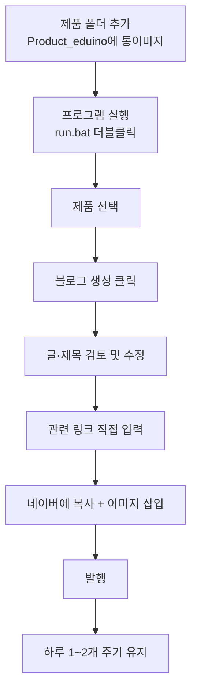

# Eduino_PostPilot 운영 가이드

이 문서는 블로그 자동화 시스템을 **실제로 운영할 때 지켜야 할 방법과 수칙**을 정리한 것입니다.
프로그램 사용법(설치·실행)은 README.md를, 운영 원칙은 이 문서를 참고하세요.

---

## 1. 전체 작업 흐름

---

## 2. 발행 주기 — 가장 중요 🚨

생성은 빠르게 해도 되지만, **발행은 천천히 꾸준히** 해야 합니다.

| 구분 | 권장 | 이유 |
|---|---|---|
| 하루 발행량 | 1~2개 | 한꺼번에 많이 올리면 네이버가 어뷰징으로 탐지 |
| 발행 간격 | 가능하면 시간대 분산 | 자동 대량 발행처럼 보이지 않게 |
| 누적 운영 | 꾸준함 > 폭발 | 정기적으로 올리는 블로그가 검색에 유리 |

🚨 **하루에 수십 개를 몰아서 발행하면 저품질 처리 위험이 큽니다.** 글 품질이 좋아도 "패턴"이 어뷰징처럼 보이면 검색 노출에서 밀립니다. 생성된 초안은 저장해 두고, 발행만 나눠서 하세요.

---

## 3. 단계별 운영 방법

### 3-1. 제품 준비
- `Product_eduino` 폴더 안에 `[순번] 코드_제품명` 형식으로 폴더 생성
- 그 안에 상세페이지 통이미지 1장 넣기
- 예: `[1] A-1_아두이노 UNO R3 SMD 호환보드\detail.png`

### 3-2. 생성
- `run.bat` 실행 → 제품 선택 → 블로그 생성 클릭
- 1편당 약 150~250원 과금

### 3-3. 검토 (사람이 꼭 확인)
- 제목: 후보 중 클릭하고 싶은 것 선택
- 소스 코드: 통이미지와 한 번 더 대조
- 스펙·수치: 사실과 일치하는지
- 어색한 문장: 자연스럽게 다듬기

### 3-4. 링크 입력
- 결과 하단 "관련 링크" 칸을 직접 채우기
- 제품 구매 링크는 그때그때, 고정 채널은 한 번 등록해두면 자동 표시

### 3-5. 발행
- 제목·본문·태그를 각각 복사해 네이버에 붙여넣기
- `[이미지 N: 설명]` 자리에 통이미지에서 캡처한 사진 삽입
- 발행

---

## 4. 발행 시 유의사항

| 항목 | 내용 |
|---|---|
| 소스 코드 | 네이버 글쓰기의 "코드블록" 기능에 넣어야 들여쓰기가 깨지지 않음 |
| 이미지 | 통이미지에서 해당 부분을 캡처해 `[이미지 N]` 자리에 삽입 |
| 대표 이미지 | 첫 번째 이미지가 검색 썸네일이 됨 → 제품 대표컷을 맨 앞에 |
| 중복 콘텐츠 | 상세페이지 문구를 그대로 복붙하지 말 것 (쇼핑몰 페이지와 중복 처리 위험). 생성된 글은 재구성된 것이므로 그대로 쓰되, 직접 베끼지 않기 |

---

## 5. 해야 할 것 / 하지 말 것

### 🟢 해도 되는 것 (안전)
- 자사 SNS·유튜브·카페에서 이 글로 자연스럽게 링크 (건전한 내부 유입)
- 키워드를 본문에 자연스럽게 분포
- 정기적 발행, 꾸준한 운영
- 생성된 초안을 검토·수정 후 발행

### 🔴 하지 말 것 (저품질·제재 위험)
- 자동 발행 (사람 검토 없이 무인 업로드) — 본 시스템이 생성까지만 자동화한 이유
- 인위적 백링크 구매 / 자동 생성 / 무관한 사이트 대량 링크
- 하루 대량 발행
- 키워드 도배 (같은 단어 부자연스럽게 반복)
- 상세페이지 문구 그대로 복붙

---

## 6. 비용·계정 관리

| 항목 | 방법 |
|---|---|
| API 비용 | OpenAI 대시보드에서 월 사용량·한도(Usage limit) 설정 권장 |
| API 키 | `.env`에만 보관. 노출 시 즉시 재발급(Revoke) |
| 결과 보관 | 생성 결과는 `output` 폴더에 저장됨 → 재참고·재사용 가능 |

---

## 7. 문제 발생 시

| 증상 | 확인 |
|---|---|
| 제품이 목록에 안 보임 | 폴더명이 `[순번] 코드_제품명` 형식인지, 통이미지가 들어있는지 |
| 코드가 흐릿하게 추출됨 | 더 고해상도 통이미지로 교체 |
| 생성 오류(인증) | `.env`의 API 키 확인 (`sk-` 한 번) |
| 글에 별표(**)가 보임 | 프롬프트가 최신인지 확인 (강조기호 제거 버전) |
