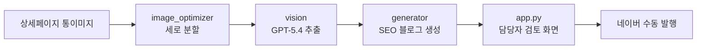

# Eduino_PostPilot

상세페이지 통이미지를 분석해 **네이버 블로그 초안을 자동 생성**하는 사내 도구입니다.
에듀이노 쇼핑몰 제품의 상세페이지(아두이노 실습 가이드가 담긴 긴 통이미지)를 입력하면,
SEO에 최적화된 블로그 글 초안을 만들어 담당자가 검토 후 발행할 수 있게 합니다.

---

## 1. 기획 배경 · 목적

에듀이노는 아두이노 기반 교육용 제품을 판매하며, 제품마다 실습 코드와 가이드가 담긴
상세페이지(통이미지)를 운영합니다. 이 자산을 블로그 콘텐츠로 재활용해

- 네이버 검색 노출을 늘리고
- 콘텐츠를 꾸준히 활성화하며
- 궁극적으로 **에듀이노 쇼핑몰로 고객을 유입**

하는 것이 목표입니다. 매번 사람이 상세페이지를 보고 글을 쓰는 수작업을, 통이미지 입력만으로
초안이 나오도록 자동화했습니다.

---

## 2. 핵심 설계 결정 (왜 이렇게 만들었나)

| 항목 | 선택 | 이유 |
|---|---|---|
| 발행 방식 | **반자동** (생성 자동 + 사람 검토 후 수동 발행) | 네이버는 자동 발행을 어뷰징으로 탐지해 저품질·계정 제재 위험이 큼. 상업적 목적일수록 위험. 글 생성까지만 자동화하고 발행은 사람이 함 |
| LLM | **OpenAI GPT-5.4** | 비용/품질 균형. 한글+아두이노 코드가 섞인 이미지 인식에 적합. 구형 모델은 비라틴 문자·작은 글씨에 약함 |
| 이미지 처리 | **폭 정규화 + 세로 분할** | 통이미지(세로 5,000px+)를 통째로 넣으면 작은 글씨·소스코드가 뭉개짐. 조각으로 잘라 해상도 확보 |
| 추출 호출 | **조각 동시 1회 호출** | 분할 조각을 한 번에 보내 전체 맥락을 유지하며 구조화 추출 |
| 글 서식 | **마크다운 강조 기호 제거** | 네이버 에디터는 `**` 등을 해석 못 해 기호가 그대로 노출되고, AI 양산형 티가 남 |
| 이미지 삽입 | **자리표시 방식** `[이미지 N: 설명]` | 글과 사진을 한 번에 만들지 않고, 글에는 자리만 표시 → 검토 후 사진을 끼워넣어 매끄럽게 |
| SEO 키워드 | **LLM 생성(B안)** | MVP를 빠르게 구축. 추후 네이버 검색광고 API(실검색량) 확장 여지 |

---

## 3. 시스템 구조



| 파일 | 역할 |
|---|---|
| `config.py` | 모델·경로·이미지 파라미터·쇼핑몰 정보 등 모든 설정 중앙 관리 |
| `image_loader.py` | 제품 폴더 스캔 + 폴더명 파싱(`[순번] 코드_제품명`) + 통이미지 찾기 |
| `image_optimizer.py` | 통이미지 폭 정규화 + 세로 분할(겹침 포함) |
| `vision.py` | 분할 조각 → GPT-5.4 비전 → 구조화 마크다운 추출 |
| `generator.py` | 추출 결과 → SEO 최적화 블로그 글 생성 |
| `app.py` | Streamlit UI (담당자가 클릭으로 생성·검토·복사) |
| `prompts/extract.txt` | 이미지 추출 프롬프트 (소스코드 정확 추출 규칙 포함) |
| `prompts/blog.txt` | 블로그 생성 프롬프트 (문체·서식·이미지 자리표시 규칙) |

---

## 4. 설치

요구사항: Windows 11, Python 3.11+

```cmd
:: 1) 가상환경 생성·활성화
python -m venv .venv
.venv\Scripts\activate

:: 2) 패키지 설치
pip install -r requirements.txt

:: 3) .env 생성 후 키 입력
copy .env.example .env
notepad .env
```

`.env`에 입력할 값:

| 키 | 설명 |
|---|---|
| `OPENAI_API_KEY` | OpenAI API 키 (앞에 `sk-` 한 번만) |
| `OPENAI_MODEL` | 기본 `gpt-5.4` |
| `SHOP_URL` | 에듀이노 쇼핑몰 주소 |
| `PRODUCTS_ROOT` | (선택) 비우면 프로젝트 내부 `Product_eduino` 사용 |

설정 점검:
```cmd
python -c "import config; config.validate()"
```

---

## 5. 사용법

### 제품 폴더 규칙
`PRODUCTS_ROOT`(기본 `Product_eduino`) 아래에 제품별 폴더를 만들고 통이미지를 넣습니다.

```
Product_eduino\
  └─ [1] A-1_아두이노 UNO R3 SMD 호환보드\
        └─ detail.png        ← 통이미지 1장
```

폴더명 규칙: `[순번] 코드_제품명`
- `[1]` 순번, `A-1` 제품코드, 첫 `_` 뒤 전부가 제품명
- 제품명에는 `_`를 쓰지 않습니다

### 실행
```cmd
streamlit run app.py
```
사내 공유(같은 망의 다른 PC에서 접속):
```cmd
streamlit run app.py --server.address 0.0.0.0
```

### 작업 흐름
1. 왼쪽에서 제품 선택 → 통이미지 미리보기 확인
2. `추출 + 블로그 생성` 클릭 (OpenAI 과금 발생)
3. 오른쪽에서 글 + 이미지 자리 목록 + 체크리스트 확인
4. 글을 검토·수정해 복사 → 네이버 블로그에 붙여넣기
5. `[이미지 N]` 자리에 통이미지에서 캡처한 사진 삽입
6. 발행

---

## 6. 비용 (참고)

| 단계 | 1편당 추정 |
|---|---|
| 추출(이미지 분석) | 약 100~150원 |
| 생성(블로그 작성) | 약 50~100원 |
| 합계 | 약 150~250원 |

추정치이며 통이미지 길이·모델에 따라 달라집니다. `config.MAX_OUTPUT_TOKENS` / `GEN_MAX_TOKENS`로 출력 상한을 두어 비용 폭주를 막습니다.

---

## 7. 보안 주의사항

- `.env`(API 키)는 `.gitignore`로 git에서 제외됩니다. **절대 커밋·공유 금지.**
- 키가 노출되면 OpenAI 대시보드에서 즉시 재발급(Revoke)하세요.
- `Product_eduino`(상품 통이미지)도 git에서 제외됩니다.

---

## 8. 향후 고도화 후보

| 후보 | 효과 |
|---|---|
| SQLite 상태관리 | "발행됨/대기" 추적, 중복 작업 방지 |
| 섹션 자동 크롭 | 이미지 자리별 사진을 자동으로 잘라 제공 |
| 네이버 검색광고 API | 실제 검색량 기반 키워드로 SEO 강화 |
